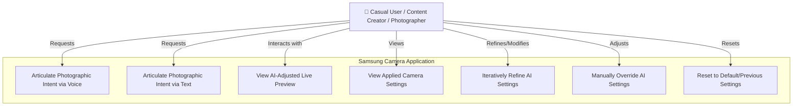

## Functional Context: Use Case Diagram

This diagram illustrates the primary interactions users will have with the "Case-based Camera Pro Settings" feature.



**Use Case Descriptions:**

1.  **UC1: Articulate Photographic Intent via Voice**
    *   **Actor:** User (Casual, Content Creator, Photographer)
    *   **Description:** The user activates the voice input mechanism within the feature and speaks their desired photographic outcome or adjustment (e.g., "Make the sunset more dramatic," "Focus on the person on the left and blur the background").
    *   **System Response:** The system captures the audio, performs speech-to-text, and processes the natural language query to understand the intent.
2.  **UC2: Articulate Photographic Intent via Text**
    *   **Actor:** User
    *   **Description:** The user types their desired photographic outcome or adjustment into a designated text input field within the feature.
    *   **System Response:** The system processes the text query to understand the intent.
3.  **UC3: View AI-Adjusted Live Preview**
    *   **Actor:** User
    *   **Description:** After the system processes the user's intent (from UC1 or UC2) and analyzes the scene, it applies the calculated camera settings. The user observes the camera's live preview, which dynamically updates to reflect these AI-driven adjustments.
    *   **Precondition:** User has provided an intent, and the system has applied settings.
4.  **UC4: View Applied Camera Settings**
    *   **Actor:** User
    *   **Description:** The user chooses to view the specific camera parameters (e.g., ISO, shutter speed, aperture, white balance) that the AI has automatically set or adjusted in response to their intent. This promotes transparency and learning.
    *   **Precondition:** AI has applied settings.
5.  **UC5: Iteratively Refine AI Settings**
    *   **Actor:** User
    *   **Description:** After observing the initial AI adjustments (UC3), the user provides further natural language commands to fine-tune the settings (e.g., "A little brighter," "Make the blur even stronger," "Now make the colors cooler").
    *   **System Response:** The system interprets the follow-up command in the context of the current settings and makes further adjustments.
6.  **UC6: Manually Override AI Settings**
    *   **Actor:** User
    *   **Description:** The user decides to take direct control and manually adjusts one or more specific camera parameters (e.g., ISO, shutter speed) using the standard Pro mode controls, overriding the AI's current suggestions for those parameters.
    *   **Precondition:** AI has applied settings, and manual controls are accessible.
7.  **UC7: Reset to Default/Previous Settings**
    *   **Actor:** User
    *   **Description:** The user chooses to revert the camera settings to a known state, such as the AI's last best comprehensive suggestion, the camera's default Pro mode settings, or a standard auto mode.
    *   **Precondition:** Settings have been modified by AI or manually.

## Behavioral Context: Flowchart and Description

This flowchart outlines the core processing loop of the "Case-based Camera Pro Settings" feature when a user provides an intent.

```mermaid
graph TD
    A[Start: User Activates Feature / Provides Input] --> B{Input Type?};
    B -- Voice --> B_STT[Speech-to-Text Conversion];
    B_STT --> C[NLP: Parse Command & Extract Intent/Entities];
    B -- Text --> C;

    C --> D[Scene Analysis: Analyze Live Camera Feed (Objects, Lighting, Context)];
    D --> E[Intent Mapping & Parameter Generation: Combine Intent + Scene Context];
    E --> F{Settings Conflict/Ambiguity?};
    F -- Yes --> F_Clarify[Prompt User for Clarification / Offer Options];
    F_Clarify --> E;
    F -- No --> G[Calculate Target Camera Settings (ISO, Shutter, Focus, WB, etc.)];

    G --> H[Apply Settings to Camera Hardware (via Camera2 API/SDK)];
    H --> I[Update Live Preview with New Settings];
    I --> J[Display Feedback: Confirmation of Action / Changed Parameters];

    J --> K{User Satisfied / Further Action?};
    K -- Take Photo --> L[Capture Image];
    K -- Refine Intent --> A; %% Loop back to provide new/refined input
    K -- Manually Adjust --> M[User Accesses Pro Controls to Override];
    K -- No Action/Wait --> K; %% Remain in current state, previewing
    M --> I; %% Manual adjustments also update preview
    L --> L_End[Image Saved, Return to Preview or Awaiting Input];
```

**Flowchart Description:**

1.  **Start: User Activates Feature / Provides Input (A):** The process begins when the user activates the Case-based Pro Settings mode or initiates a command within it.
2.  **Input Type? (B):** The system determines if the input is voice or text.
    *   If **Voice**, it proceeds to **Speech-to-Text Conversion (B_STT)** to convert the spoken words into a text string.
    *   If **Text** (or after STT), it moves to **NLP Processing (C)**.
3.  **NLP: Parse Command & Extract Intent/Entities (C):** The natural language query is processed to identify the user's core photographic intent, relevant subjects, desired effects, and any specific parameters mentioned.
4.  **Scene Analysis: Analyze Live Camera Feed (D):** Concurrently or sequentially, the system analyzes the live view from the camera to understand the current scene composition, lighting conditions, identifiable objects, and other contextual information.
5.  **Intent Mapping & Parameter Generation (E):** The structured intent from NLP (C) and the scene context from Scene Analysis (D) are fed into the core logic engine. This engine decides how to translate the user's desire into concrete camera settings.
6.  **Settings Conflict/Ambiguity? (F):** The system checks if the request is ambiguous, if there are conflicting desires, or if critical information is missing.
    *   If **Yes**, it may **Prompt User for Clarification / Offer Options (F_Clarify)**, then loop back to (E) with the refined information.
    *   If **No**, it proceeds to calculate the settings.
7.  **Calculate Target Camera Settings (G):** Specific values for ISO, shutter speed, aperture, focus parameters, white balance, etc., are determined.
8.  **Apply Settings to Camera Hardware (H):** The calculated settings are sent to the camera hardware via the appropriate APIs (Camera2 or vendor-specific SDKs).
9.  **Update Live Preview with New Settings (I):** The camera's live viewfinder image is updated to reflect the newly applied settings.
10. **Display Feedback (J):** The user is provided with confirmation of the action taken (e.g., "Okay, focusing on the flower") and, optionally, can see the specific parameters that were changed.
11. **User Satisfied / Further Action? (K):** The system awaits the user's next move:
    *   **Take Photo (L):** If the user initiates image capture, the current settings are used. The image is saved, and the system may return to a preview state or await further input (**L_End**).
    *   **Refine Intent (A):** The user provides another voice/text command to iterate on the current settings, looping the process.
    *   **Manually Adjust (M):** The user opts to use the standard Pro controls to manually tweak settings. These manual changes also update the live preview (back to **I**). The AI system should ideally be aware of these manual overrides to avoid immediately changing them back unless a new AI command is given.
    *   **No Action/Wait (K):** The system remains in the current state, displaying the live preview with the applied settings.

## Non-Functional Requirements

Here are 5 distinct and extensive Non-Functional Requirements (NFRs), building on previous discussions:

1.  **NFR1: Real-Time Performance and Responsiveness:**
    *   **Description:** The entire process from user command initiation (voice or text) to a visibly updated live preview reflecting the AI-driven settings changes must feel instantaneous to the user. This involves minimizing latency across speech-to-text, NLP processing, scene analysis, intent mapping, and camera parameter application.
    *   **Metrics:**
        *   **End-to-End Latency (P90):** < 500 milliseconds from end of user utterance/text submission to visible change in live preview for 90% of interactions.
        *   **NLP Processing Time (On-Device):** < 150 milliseconds.
        *   **Scene Analysis Frame Rate:** Basic scene analysis (e.g., light level, dominant objects) should not degrade the live preview frame rate below 24 FPS. More intensive CV tasks should be optimized or run asynchronously if they risk impacting preview smoothness.
        *   **Camera Setting Application Latency:** < 50 milliseconds via Camera2 API or SDK.
    *   **Rationale:** A laggy experience will frustrate users and undermine the feeling of intuitive, direct control, making the feature feel clunky rather than an extension of their creative thought.

2.  **NFR2: Accuracy and Reliability of Interpretation & Action:**
    *   **Description:** The system must accurately interpret a wide range of natural language phrasings for photographic intent and reliably translate these intents into appropriate and predictable camera setting adjustments. It must perform consistently across various supported devices and environmental conditions.
    *   **Metrics:**
        *   **Intent Recognition Accuracy (Top-1):** > 90% for common photographic commands within a predefined test set of diverse phrasings.
        *   **Parameter Extraction F1-Score:** > 85% for key entities like subject, location, and qualitative descriptors.
        *   **Mean Opinion Score (MOS) for Resulting Image Quality:** Users should rate AI-suggested settings as improving or correctly achieving their stated goal at least 4 out of 5 times on average for well-defined common scenarios.
        *   **Crash Rate:** < 0.01% crashes attributed to the feature during a session.
        *   **Graceful Degradation:** In cases of highly ambiguous input or unsupported requests, the system should provide helpful feedback or offer alternatives rather than failing silently or producing bizarre results.
    *   **Rationale:** Users need to trust that the feature understands them correctly and will produce desirable photographic outcomes. Unreliable or erratic behavior will lead to abandonment.

3.  **NFR3: On-Device Processing, Privacy, and Security:**
    *   **Description:** All core processing, particularly speech-to-text, natural language understanding, and scene analysis (especially if it involves identifiable features like faces), must occur entirely on the device. No user voice data or identifiable image content related to these core functions should be transmitted to the cloud for processing to ensure user privacy and data security. Model updates can be fetched from the cloud but inference must be local.
    *   **Metrics:**
        *   **Data Locality:** Verification through network traffic analysis that no PII (Personally Identifiable Information), voice snippets, or full-resolution unprocessed image frames are sent to external servers during active feature use (excluding explicit sharing actions by the user or anonymous/aggregated analytics if opt-in).
        *   **Compliance:** Adherence to relevant data privacy regulations (e.g., GDPR, CCPA).
        *   **Secure Model Storage & Updates:** Mechanisms for securely storing on-device models and verifying the integrity of downloaded model updates.
    *   **Rationale:** User privacy is paramount, especially with features that process voice and visual information. On-device processing builds trust and ensures functionality even without a network connection.

4.  **NFR4: Optimized Resource Consumption and Battery Efficiency:**
    *   **Description:** The feature, while leveraging powerful AI and CV capabilities, must be optimized to minimize its impact on device resources such as CPU, GPU, NPU, memory, and battery life. It should not lead to excessive device heating or rapid battery drain during normal use.
    *   **Metrics:**
        *   **Average CPU/GPU/NPU Load during active use:** Within acceptable thresholds defined for camera applications on target devices (e.g., CPU < X% average over 5 mins, NPU < Y% average).
        *   **Memory Footprint:** AI models and runtime should be optimized for mobile deployment, with a clearly defined maximum memory budget.
        *   **Battery Drain Increase:** Additional battery consumption attributable to the feature during a typical 10-minute photo session should be < Z% compared to standard camera auto mode.
        *   **Thermal Throttling:** Feature usage should not consistently trigger device thermal throttling under normal ambient temperatures.
    *   **Rationale:** A feature that significantly degrades overall device performance or battery life will not be well-received, regardless of its functional benefits. Efficient resource management is key for a positive user experience on mobile devices.

5.  **NFR5: Usability, Learnability, and User Agency:**
    *   **Description:** The feature must be easy to discover, learn, and use for the target audience (ranging from casual users to enthusiasts). Users should always feel in control, with clear feedback, intuitive interaction patterns, and the ability to easily override or disengage the AI assistance.
    *   **Metrics:**
        *   **Task Completion Rate:** > 95% of users should be able to successfully achieve a common photographic goal (e.g., "make the background blurry for a portrait") using the feature within 3 attempts in usability testing.
        *   **System Usability Scale (SUS) Score:** Aim for a SUS score > 75.
        *   **Time to Learn Basic Interaction:** Users should understand the core voice/text command interaction within their first 1-2 uses.
        *   ** discoverability of Override/Manual Controls:** Users should be able to easily find and use manual override options when desired.
        *   **Error Recovery:** Users should be able to easily recover from misinterpretations or undesired AI adjustments (e.g., via undo, reset, or rephrasing).
    *   **Rationale:** Even the most powerful feature will fail if it's confusing, difficult to use, or makes users feel like they've lost control. Strong usability and a clear sense of user agency are critical for adoption and satisfaction.
